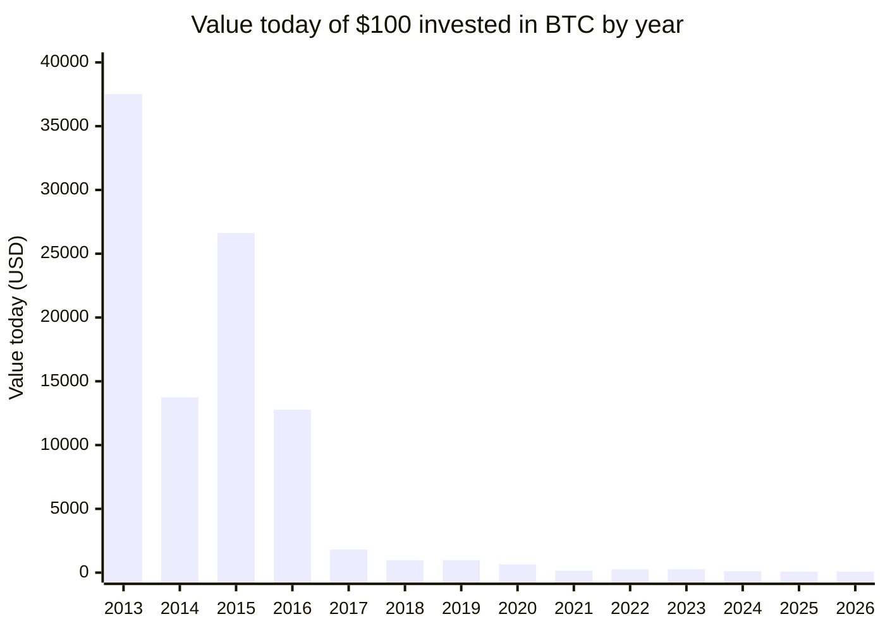

# BTC What-If

  

> **"What if I had bought Bitcoin?"**

This project answers the question everyone in crypto eventually asks: *how much would **$100** have grown if invested in Bitcoin at the average price of any given year?*

Starting from 2010 — the first year BTC had a real exchange price — the script fetches the live BTC/USD rate from CoinGecko, computes yearly average prices, and calculates the hypothetical return on a $100 investment for every year since.

## How it works

- **Investment assumption:** $100 invested at the yearly average USD price for BTC
- **Price source:** [CoinGecko API](https://www.coingecko.com/) — live spot price + historical yearly averages
- **Auto-updated:** A GitHub Actions workflow runs daily and commits fresh results to this README

## Returns at a glance (2013 – 2026)

_Value today of $100 invested at each year's average price (USD):_

> Earlier years (2010–2012) are off the chart — $100 in 2010 would be worth **~$103 million** today.

  

## Full results table

<!-- BTC_RESULTS_START -->
_Last updated: **Thursday, April 09, 2026** — BTC price: **$72,408.00**_

| Year | Avg BTC price | BTC you'd get for $100 | Value today | Return |
|------|--------------|------------------------|-------------|--------|
| 2010 | $0.0700 | 1428.571429 BTC | $103.44M | +1034400.0x |
| 2011 | $5.97 | 16.750419 BTC | $1.21M | +12128.6x |
| 2012 | $8.27 | 12.091898 BTC | $875,550.18 | +8755.5x |
| 2013 | $193.00 | 0.518135 BTC | $37,517.10 | +375.2x |
| 2014 | $527.00 | 0.189753 BTC | $13,739.66 | +137.4x |
| 2015 | $272.00 | 0.367647 BTC | $26,620.59 | +266.2x |
| 2016 | $567.00 | 0.176367 BTC | $12,770.37 | +127.7x |
| 2017 | $3,996.00 | 0.025025 BTC | $1,812.01 | +18.1x |
| 2018 | $7,382.00 | 0.013546 BTC | $980.87 | +9.8x |
| 2019 | $7,379.00 | 0.013552 BTC | $981.27 | +9.8x |
| 2020 | $11,135.00 | 0.008981 BTC | $650.27 | +6.5x |
| 2021 | $47,111.00 | 0.002123 BTC | $153.70 | +1.5x |
| 2022 | $28,145.00 | 0.003553 BTC | $257.27 | +2.6x |
| 2023 | $26,890.00 | 0.003719 BTC | $269.27 | +2.7x |
| 2024 | $65,000.00 | 0.001538 BTC | $111.40 | +1.1x |
| 2025 | $90,000.00 | 0.001111 BTC | $80.45 | -19.5% |
| 2026 \* | $84,000.00 | 0.001190 BTC | $86.17 | -13.8% |

\* 2026 is partial — average covers Jan 1 through today (estimated YTD average)
<!-- BTC_RESULTS_END -->
